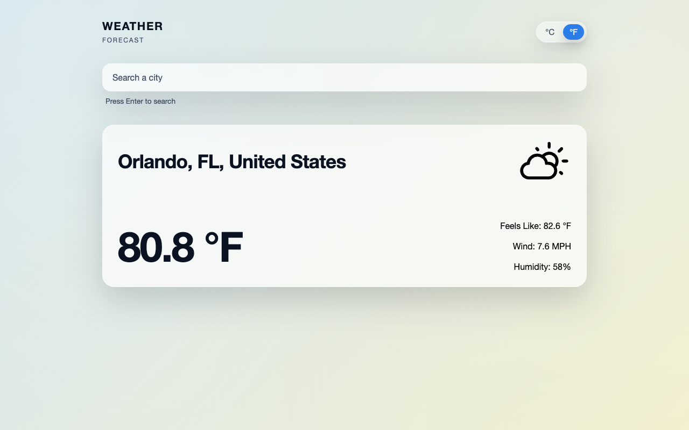

# Weather App

A weather-search app for practicing **API calls and asynchronous rendering** in
JavaScript. It fetches forecast data for a searched city, maps the response into
display-ready fields, and renders condition-specific icons — bundled with Webpack.

🔗 **Live demo:** [weather-eight-umber.vercel.app](https://weather-eight-umber.vercel.app/)



## Features

- City search with async loading and result updates.
- Weather data fetching kept separate from display rendering.
- Condition-specific icons (clear, cloudy, rain, snow, wind, fog, storm).
- Fahrenheit/Celsius conversion controls; initializes with Orlando weather.

## Tech stack

JavaScript · HTML · CSS · **Webpack** · `dotenv` (build-time API config)

## Getting started

```bash
npm install
npm start        # webpack dev server
npm run build    # production bundle
```

### Environment variables

The build reads API config from environment values (via `dotenv`). Variable **names**
only — set these in a local `.env` (gitignored):

| Variable | Used for |
|---|---|
| `KEY` | Weather API key |
| `BASE` | Weather API base URL |

## What I practiced

Working with `fetch` and **async/await**, shaping a third-party API response into a
clean view model, and keeping secrets out of source via environment variables.

## License

Odin Project coursework — original implementation by Aziz Umarov.
